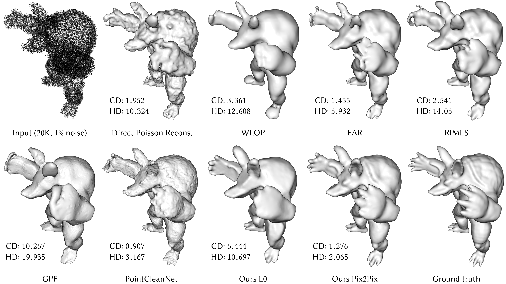

# DSS: Differentiable Surface Splatting

| [Paper PDF](https://igl.ethz.ch/projects/differentiable-surface-splatting/DSS-2019-SA-Yifan-etal.pdf) | [Project page](https://igl.ethz.ch/projects/differentiable-surface-splatting/) |
| ----------------------------------------------------------------------------------------------------- | ------------------------------------------------------------------------------ |


code for paper Differentiable Surface Splatting for Point-based Geometry Processing

```diff
+ Mar 2021: major updates tag 2.0.
+ > Now supports simultaneous normal and point position updates.
+ > Unified learning rate using Adam optimizer.
+ > Highly optimized cuda operations
+ > Shares pytorch3d structure
```

- [DSS: Differentiable Surface Splatting](#dss-differentiable-surface-splatting)
  - [Installation](#installation)
  - [Demos](#demos)
    - [inverse rendering - shape deformation](#inverse-rendering---shape-deformation)
    - [~~denoising (TBA)~~](#denoising-tba)
  - [video](#video)
  - [cite](#cite)
  - [Acknowledgement](#acknowledgement)

## Installation

1. install prequisitories. Our code uses python 3.8, pytorch 1.6.0, pytorch3d 0.2.5. the installation instruction requires the latest anaconda.

```bash
# we tested with cuda 10.2, pytorch 1.6.0, and pytorch 0.2.5
# install requirements
conda create -n DSS python=3.8
conda activate DSS
conda install -c pytorch pytorch=1.6.0 torchvision cudatoolkit=10.2
conda install -c fvcore -c iopath -c conda-forge fvcore iopath
conda install -c bottler nvidiacub
conda install -c pytorch3d pytorch3d=0.2.5
pip install -r requirements.txt
pip install "git+https://github.com/mmolero/pypoisson.git"
```

2. clone and compile

```bash
git clone --recursive https://github.com/yifita/DSS.git
cd DSS
# if you have cloned it without `--recusive`, you can execute this command under DSS/
# git submodule update --init --recursive
# compile external dependencies
cd external/prefix_sum
pip install .
cd ../FRNN
pip install .
cd ../torch-batch-svd
pip install .
# compile library
cd ../..
pip install -e .
```

## Demos

### inverse rendering - shape deformation

```bash
# create mvr images using intrinsics defined in the script
python scripts/create_mvr_data_from_mesh.py --points example_data/mesh/yoga6.ply --output example_data/images --num_cameras 128 --image-size 512 --tri_color_light --point_lights --has_specular

python train_mvr.py --config configs/dss.yml
```

Check the optimization process in tensorboard.

```
tensorboard --logdir=exp/dss_proj
```

### ~~denoising (TBA)~~

We will add back this function ASAP.



## video

[](https://youtu.be/MIu59GiJZ2s "Accompanying video")

<!-- [Accompanying video](https://youtu.be/Q8iTkmIky0o) -->

## cite

Please cite us if you find the code useful!

```
@article{Yifan:DSS:2019,
author = {Yifan, Wang and
          Serena, Felice and
          Wu, Shihao and
          {\"{O}}ztireli, Cengiz and
         Sorkine{-}Hornung, Olga},
title = {Differentiable Surface Splatting for Point-based Geometry Processing},
journal = {ACM Transactions on Graphics (proceedings of ACM SIGGRAPH ASIA)},
volume = {38},
number = {6},
year = {2019},
}
```

## Acknowledgement

We would like to thank Federico Danieli for the insightful discussion, Phillipp Herholz for the timely feedack, Romann Weber for the video voice-over and Derek Liu for the help during the rebuttal.
This work was supported in part by gifts from Adobe, Facebook and Snap, Inc.
